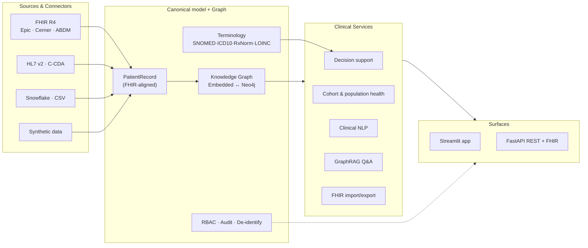

<div align="center">

# 🩺 MediGraph AI

### Clinical Knowledge Graph & Decision-Support Platform — with LLM integration

*Unify the medical record into a graph, then reason over it: decision support, population health, clinical NLP, grounded GraphRAG Q&A and FHIR interoperability — for real clinics and hospitals in the US and India.*

[](tests/)
[](pyproject.toml)
[](LICENSE)
[](#-two-modes-offline-by-default-live-when-you-want)
[](docs/CONNECTORS.md)

**[▶ Live demo website](https://aravindb98.github.io/medigraph-ai/)** · **[📘 Docs](docs/)** · **[🔌 Connectors](docs/CONNECTORS.md)** · **[🧠 Clinical use cases](docs/CLINICAL_USE_CASES.md)**

</div>

---

## Why MediGraph AI

A patient's reality is a **network** — encounters lead to diagnoses, diagnoses drive medications, medications interact, providers share panels — but most systems store it in disconnected tables. MediGraph AI models the record as a **property graph**, attaches a curated clinical knowledge base (SNOMED CT · ICD-10-CM · RxNorm · LOINC), and computes **transparent, citable** decision support on top. Questions like *"which of my atrial-fibrillation patients aren't anticoagulated?"* or *"who's overdue for an HbA1c?"* become one click — and every answer can point back to the exact graph nodes and guidelines behind it.

> This repository is a ground-up v2 rebuild of the original MediGraph prototype (a single 1,592-line Streamlit script wired to one private Snowflake + Neo4j + OpenAI account). It keeps **every original capability** and turns the project into a modular, tested, **runs-anywhere** platform. See [CHANGELOG](CHANGELOG.md).

---

## ✨ Two modes: offline by default, live when you want

| | **Offline (default)** | **Live (opt-in)** |
|---|---|---|
| **Data** | Bundled synthetic EHR (120 US + India patients) | Your EHR via FHIR/HL7/C-CDA, Snowflake, CSV |
| **Graph** | Embedded in-memory NetworkX graph | Neo4j AuraDB |
| **LLM** | Deterministic query planner (no key) | OpenAI (guard-railed, read-only Cypher) |
| **Credentials** | **None — launches instantly** | Set the ones you need, independently |

```bash
git clone https://github.com/AravindB98/medigraph-ai.git && cd medigraph-ai
pip install -r requirements.txt
streamlit run ui/streamlit_app.py        # clinical UI  → http://localhost:8501
uvicorn medigraph.api.main:app --reload  # REST + FHIR  → http://localhost:8000/docs
```

No `.env`, no database, no API key required to see the whole platform working.

---

## 🚀 Capabilities

| Area | What it does |
|---|---|
| 🧑‍⚕️ **Patient 360 & decision support** | LACE readmission, CHA₂DS₂-VASc, HAS-BLED, **eGFR (CKD-EPI 2021)** & CKD staging, evidence-based **care-gap detection**, **drug–drug interaction** screening |
| 📈 **Population health** | Disease prevalence, HEDIS-style **quality measures**, utilisation, LACE risk stratification, outreach priority list |
| 👥 **Cohort builder** | Compose conditions, meds, demographics & lab thresholds into registries; preset registries included |
| 🕸️ **Knowledge graph** | Live subgraph visualisation + **provider-network PageRank centrality** & community detection (GDS-style) |
| 📝 **Clinical NLP** | Dictionary **NER with negation detection**, SNOMED/RxNorm/LOINC mapping, guideline linking from free-text notes |
| 💬 **GraphRAG Q&A** | Natural-language questions answered from graph facts **with citations**; **read-only guardrail** on any LLM-generated Cypher |
| 🔌 **Interoperability** | **FHIR R4**, **HL7 v2** (ADT/ORU), **C-CDA** adapters + vendor profiles for **35+ US & India systems** |
| 🛡️ **Security** | Role-based access control, JWT auth, append-only **audit trail**, HIPAA Safe-Harbor **de-identification** |

All of this is exercised in the **[live demo](https://aravindb98.github.io/medigraph-ai/)** and covered by tests.

---

## 🏗️ Architecture



Pluggable at every seam: the graph backend (`embedded` ↔ `neo4j`) and the LLM provider (`mock` ↔ `openai`) are each chosen from environment variables and can be swapped **without touching clinical logic**. See [docs/ARCHITECTURE.md](docs/ARCHITECTURE.md).

---

## 🔌 Connects to what clinics & hospitals actually use

Interoperability in both countries converges on a handful of standards, so a small set of well-built adapters covers a long tail of vendors. Full table in [docs/CONNECTORS.md](docs/CONNECTORS.md).

| Region | Systems (examples) | Path |
|---|---|---|
| 🇺🇸 US | Epic, Oracle Health (Cerner), athenahealth, Veradigm, eClinicalWorks, NextGen, MEDITECH; Google/AWS/Azure FHIR; TEFCA/Carequality/CommonWell | **FHIR R4** / HL7 v2 / C-CDA |
| 🇮🇳 India | **ABDM / ABHA** national stack, HFR/HPR, eSanjeevani, KareXpert, Insta by Practo, Napier, Birlamedisoft, MocDoc | **FHIR R4 (India IG)** / HL7 v2 / CSV |
| 🌐 Global | Any FHIR R4 server · HL7 v2 feeds · C-CDA docs · CSV · Snowflake · Neo4j | Built-in, tested |

Adding a new integration is drop-in: subclass `BaseConnector`, decorate with `@register(...)`, and it appears in the registry, the UI and the API.

---

## 🧠 Clinical depth (transparent & citable)

Every score is rule-based and explainable — no black box — which is exactly what clinicians and regulators expect:

- **eGFR** — 2021 CKD-EPI creatinine equation (race-free) → KDIGO G-stage
- **LACE index** — 30-day readmission risk (Length-of-stay · Acuity · Comorbidity · ED visits)
- **CHA₂DS₂-VASc** — stroke risk in atrial fibrillation
- **HAS-BLED** — bleeding risk to balance anticoagulation decisions
- **Care gaps** — e.g. diabetic overdue for HbA1c, ASCVD without a statin, AF with high CHA₂DS₂-VASc and no anticoagulant, uncontrolled BP — each tagged with the guideline (ADA, ACC/AHA, KDIGO, CHEST/ESC)
- **Drug–drug interactions** — curated, well-established pairs with mechanism & management

See [docs/CLINICAL_USE_CASES.md](docs/CLINICAL_USE_CASES.md).

---

## 🛠️ REST + FHIR API

A documented FastAPI surface mirrors the UI so a hospital can integrate programmatically. Interactive docs at `/docs`.

```http
POST /auth/login                 → JWT
GET  /patients/{id}              → record (PHI-gated by role)
GET  /patients/{id}/assessment   → risk scores, care gaps, interactions
GET  /patients/{id}/fhir         → FHIR R4 Bundle
POST /fhir/import                → ingest a FHIR Bundle
POST /cohort                     → build a cohort
GET  /analytics/quality          → quality measures
POST /qa                         → grounded GraphRAG answer
GET  /connectors/catalog         → supported systems (US/India)
GET  /audit                      → audit trail (auditor/admin only)
```

Full reference in [docs/API.md](docs/API.md).

---

## 🛡️ Security & compliance

Role-based access control (`clinician`, `nurse`, `analyst`, `admin`, `auditor`), JWT sessions, an append-only **audit trail** of every patient access and query, and HIPAA Safe-Harbor **de-identification** for analyst workflows. Designed with HIPAA (US) and DPDP/ABDM (India) accountability in mind. See [docs/SECURITY.md](docs/SECURITY.md).

> ⚠️ The original prototype committed live credentials and a virtualenv to git. v2 removes them, gitignores `.env`, and ships only `.env.example`. **Rotate any previously committed Snowflake/Neo4j/OpenAI secrets — treat them as compromised.**

---

## 🧪 Testing

```bash
python -m pytest -q        # 50 tests: graph, decision support, cohorts,
                           # cypher guard, FHIR, NLP, connectors, security, API
```

---

## 📁 Project structure

```
medigraph/
├── config.py            # offline/live settings (zero-credential default)
├── domain/              # FHIR-aligned models + clinical terminology
├── data/                # synthetic-EHR generator + bundled CSVs
├── graph/               # backend interface · embedded · neo4j · cypher guard
├── services/            # decision support · cohort · analytics · nlp · fhir · qa
├── llm/                 # planner interface · mock · openai
├── security/            # rbac · auth (JWT) · audit · de-identification
├── connectors/          # base · fhir · hl7v2 · ccda · csv · snowflake · catalog
└── api/                 # FastAPI REST + FHIR
ui/streamlit_app.py      # role-aware multi-page clinical workspace
website/                 # self-explaining GitHub Pages demo
tests/                   # pytest suite
docs/                    # architecture, clinical, connectors, security, API…
```

---

## 🗺️ Roadmap

SMART-on-FHIR launch, TEFCA/QHIN query, OMOP CDM export, vector/semantic retrieval for GraphRAG, transformer-based clinical NER (medspaCy), FHIR Subscriptions for real-time feeds, agentic care-coordination workflows. Details in [docs/ROADMAP.md](docs/ROADMAP.md).

---

## ⚖️ Disclaimer

MediGraph AI is **research and demonstration software** — not a certified medical device, and not FDA/CDSCO cleared. All bundled data is **synthetic** and contains no real PHI. Risk scores, care-gap alerts and AI answers are decision-support aids and must not replace the judgement of a qualified clinician.

Built by **Aravind Balaji** · MIT licensed.
