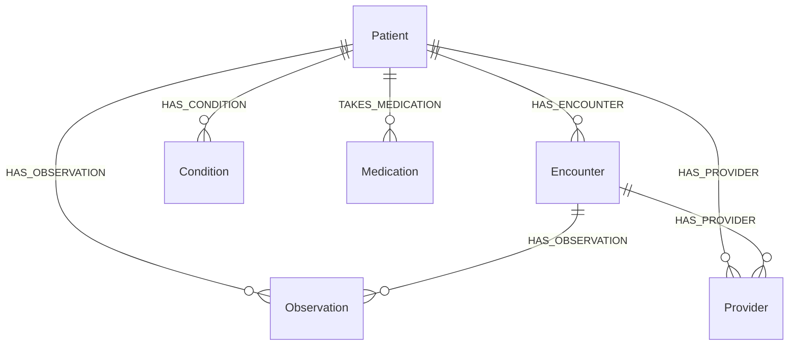

# Data model

## Knowledge-graph schema

This mirrors the original MediGraph AI graph and stays close to FHIR R4 resources,
so import/export is a thin mapping rather than a translation.

## Canonical objects (`medigraph/domain/models.py`)

| Model | Key fields | FHIR analogue |
|---|---|---|
| `Patient` | id, full_name, sex, birth_date, age, city, state, country, **mrn**, **abha_id** | Patient |
| `ConditionInstance` | code_key, name, **snomed**, **icd10**, clinical_status, onset_date | Condition |
| `MedicationInstance` | code_key, name, **rxnorm**, drug_class, status | MedicationStatement |
| `ObservationInstance` | code_key, name, **loinc**, value, unit, category, effective_datetime, interpretation | Observation |
| `Encounter` | id, encounter_class, start, end, length_of_stay_days, via_emergency | Encounter |
| `Provider` | id, name, specialty, **npi** (US), **hpr_id** (India) | Practitioner |
| `PatientRecord` | bundles all of the above for one patient | (a small Bundle) |

`PatientRecord` also exposes derived helpers used throughout the platform:
`condition_keys`, `medication_keys`, `latest_observation(code_key)` and
`ed_visits_last_6mo(as_of)`.

## Clinical terminology (`medigraph/domain/terminology.py`)

A curated teaching subset of standard vocabularies, the "clinical brain" the
analytics reason over:

- **15 conditions** with SNOMED CT + ICD-10-CM codes and Charlson comorbidity weights
- **20 medications** with RxNorm codes, ATC classes and the conditions they treat
- **19 observations** (labs & vitals) with LOINC codes and reference ranges
- **12 drug–drug interactions** with severity, mechanism and management
- **8 guideline references** (ADA, ACC/AHA, KDIGO, CHEST/ESC, GOLD, HFSA)

Identifiers are real, well-known codes included for realism and interoperability
demonstrations. A production deployment would back this with a full terminology
service (e.g. a SNOMED/LOINC/RxNorm server).

## Bundled synthetic dataset

`medigraph/data/generator.py` deterministically generates a clinically *coherent*
dataset (same seed ⇒ identical files): ~120 patients (≈⅔ US, ⅓ India), with
correlated conditions, medications and labs and a few **intentional care gaps**
(e.g. a diabetic overdue for HbA1c, an AF patient not anticoagulated) so the alerts
demonstrably fire. Output is six CSVs in `medigraph/data/synthetic/`:
`patients`, `providers`, `conditions`, `medications`, `encounters`, `observations`.

Regenerate (optionally larger): `MEDIGRAPH_SYNTH_PATIENTS=500 python -m medigraph.data.generator`.
